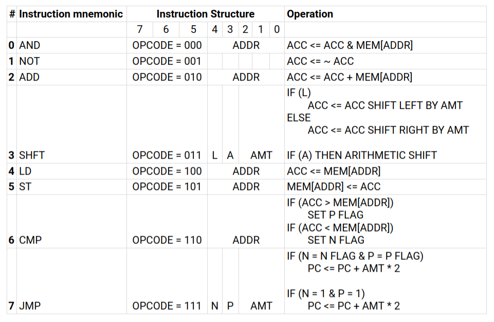

# Byte-Computer
  

Byte computer is an in-order, no register file, no-cache, non-pipelined and no branch predictor implementation of an 8-bit Turing complete computer thus making it extremely simple and small enough for TinyTapeout.

## How it works?
The computer fetches instruction at the address in the program counter which has an initial value of zero. The instruction is decoded and then executed followed by setting appropriate condition flags. The program counter is incremented and the fetch -> decode -> execute process repeats until a halt instruction is fetched and executed.

## Instruction Set Architecture
The Instruction Set Architecture (ISA) for the computer is described in the table below

The computer has 8 instructions: AND, NOT, ADD, and SHFT perform data manipulation, LD and ST perform memory access and CMP and JMP perform control flow

- Data manipulation
    - Logical operations: AND & NOT

        The AND instruction performs logical and operation on the accumulator value and the value at the memory address encoded in the instruction. The NOT instruction inverts the bit in the accumulator. Multiple AND and NOT instructions can be issued to the computer to perform all kinds of logical operations. 

    - Arithmetic operations: ADD & SHFT
        
        The ADD instruction performs the addition of accumulator value with value at the memory address encoded in the instruction. The SHFT instruction performs a left or right shift by AMT in a logical or arithmetic fashion depending on the L and A bits respectively.

- Memory access 
    - Load operation: LD
        
        The LD instruction loads data at a memory address encoded in the instruction and sets the accumulator register.

    - Store operation: ST

        The ST instruction stores data from the accumulator register at the memory address encoded in the instruction.

- Control flow
    - Compare operation: CMP

        The CMP instruction performs a comparison of the value inside the accumulator with the value at the address encoded in the instruction. The P flag is set if the value is relatively positive and the N flag is set if the value is relatively negative.

    - Jump operation: JMP

        The JMP instruction performs unconditional jump by incrementing or decrementing the program counter by jump amount multiplied by 2. The instruction also performs a conditional jump by checking if the N or P flag is set.

    - No operation: JMP

        No operation is implemented using the JMP instruction and setting the jump amount to zero. 

    - Halt: JMP

        Halt is a special case of unconditional jump where all bits are set to one.

# Implementation of other data manipulation operations
Other data manipulation operations can be implemented using instructions available in the ISA.

- Bitwise logical OR: 

    OR can be implemented by using De Morgan law: NOT(AND(NOT(A), NOT(B))).

- Subtraction operation:

    Subtraction operation can be performed by using 2's complement: A + (NOT(B) + 1)

## GDS Layout in SKY130 process node 

### Made with lots of ⏱️, 📚 and ☕ by InputBlackBoxOutput
